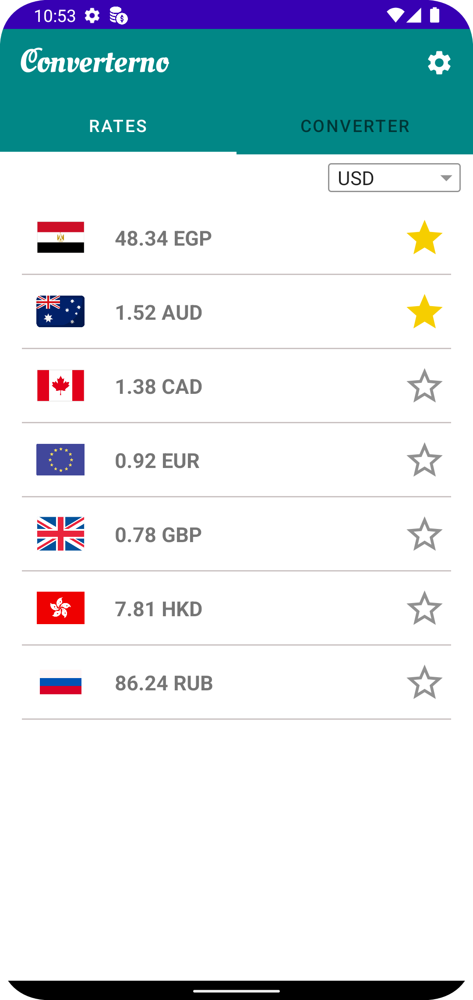
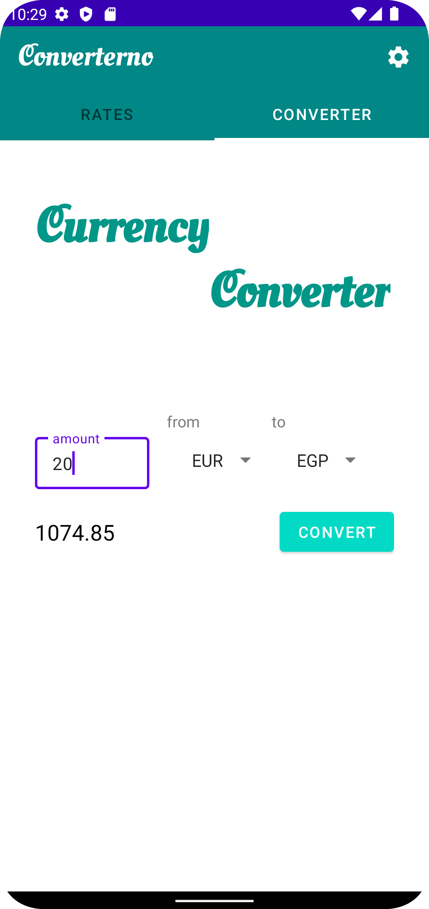
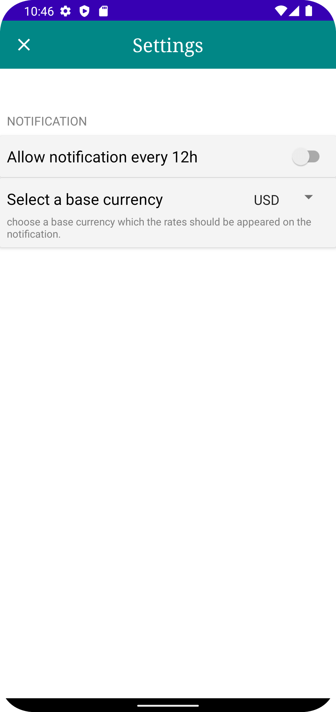
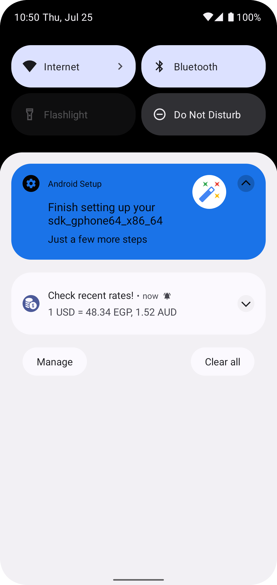

# CurrencyConverter Application
An application where currency values can be easily converted to and from +30 different currencies based on current exchange rates.

## Description

### A CurrencyConverter app that enables user to:
* easy conversion of currency values based on present-day exchange rates.
* check the latest foreign exchange rates.
* get notified every 12h with latest exchange rates.
* choose favourite currencies.

### Implemented using

* Retrofit using currencyfreaks API.
* Dependency injection with Dagger-Hilt.
* MVVM architecture.
* DataBinding & BindingAdapter.
* AlaramManager & NotificationManager.
* SharedPreferrence to hold favourite currencies.

## Screens

  
   
  
  

 
